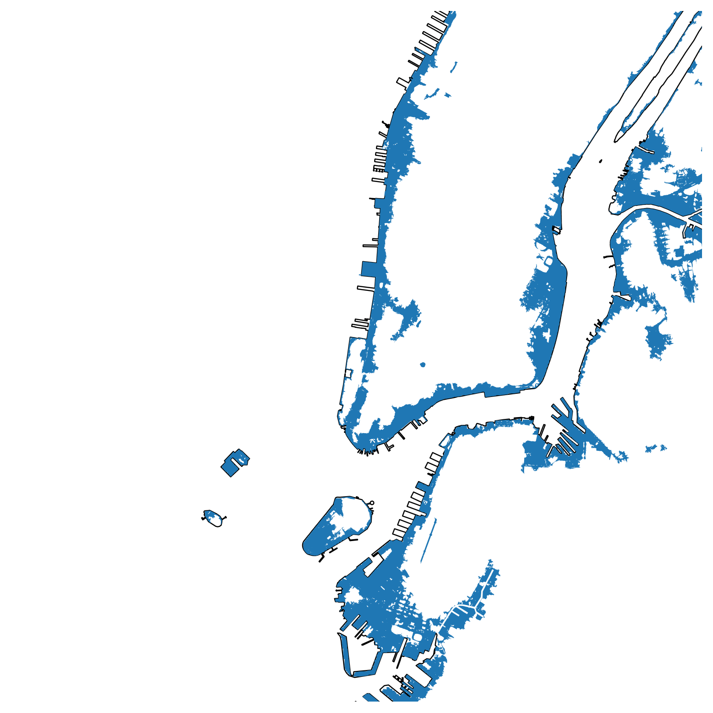

# A Collection of Flood Hazard Layers for New York City
Author: Mark Bauer

A collection of free and publicly available flood hazard layers for New York City. You can find a tutorial on how to download and explore these files in Python in the [download-layers.ipynb](https://github.com/mebauer/nyc-flood-layers/blob/main/download-layers.ipynb) notebook. The tutorial focuses on open source and reproducible workflows.

| Dataset | Description |
| :-------- | :---------- |
| [Sandy Inundation Zone](https://data.cityofnewyork.us/Environment/Sandy-Inundation-Zone/uyj8-7rv5) | Areas of New York City that were flooded as a result of Hurricane Sandy. |
| [Hurricane Evacuation Zones](https://data.cityofnewyork.us/Public-Safety/Hurricane-Evacuation-Zones/uihr-hn7s) | Hurricane Evacuation Zones are determined by New York City Emergency Management and represent varying threat levels of coastal flooding resulting from storm surge. Hurricane evacuation zones should not be confused with flood insurance risk zones, which are designated by FEMA and available in the form of Flood Insurance Rate Maps (FIRMs). |
| [NYC Stormwater Flood Map - Moderate Flood with Current Sea Levels](https://data.cityofnewyork.us/Environment/NYC-Stormwater-Flood-Map-Moderate-Flood-with-Curre/7r5q-vr7p) | Citywide Geographic Information System (GIS) layer that shows areas of potential flooding under the Moderate Stormwater Flood with Current Sea Levels scenario. Please see the New York City Stormwater Resiliency Plan for more information. |
| [NYC Stormwater Flood Map - Moderate Flood with 2050 Sea Level Rise](https://data.cityofnewyork.us/City-Government/NYC-Stormwater-Flood-Map-Moderate-Flood-with-2050-/5rzh-cyqd) | Citywide Geographic Information System (GIS) layer that shows areas of potential flooding under the Moderate Stormwater Flood with 2050 Sea Level Rise scenario. Please see the New York City Stormwater Resiliency Plan for more information. |
| [NYC Stormwater Flood Map - Extreme Flood with 2080 Sea Level Rise](https://data.cityofnewyork.us/City-Government/NYC-Stormwater-Flood-Map-Extreme-Flood-with-2080-S/w8eg-8ha6) | Citywide Geographic Information System (GIS) layer that shows areas of potential flooding under the Extreme Stormwater Flood with 2080 Sea Level Rise scenario. Please see the New York City Stormwater Resiliency Plan for more information. |
| [Sea Level Rise Maps (2020s 100-year Floodplain](https://data.cityofnewyork.us/Environment/Sea-Level-Rise-Maps-2020s-100-year-Floodplain-/ezfn-5dsb) | This is the 100-Year Floodplain for the 2020s based on FEMA's Preliminary Work Map data and the New York Panel on Climate Change's 90th Percentile Projects for Sea-Level Rise (11 inches). Please see the Disclaimer PDF for more information. Data Provided by the Mayor's Office of Long-Term Planning and Sustainability (OLTPS) on behalf of CUNY Institute for Sustainable Cities (CISC) and the New York Panel on Climate Change (NPCC). |
| [Sea Level Rise Maps (2020s 500-year Floodplain)](https://data.cityofnewyork.us/Environment/Sea-Level-Rise-Maps-2020s-500-year-Floodplain-/ajyu-7sgg) | This is the 500-Year Floodplain for the 2020s based on FEMA's Preliminary Work Map data and the New York Panel on Climate Change's 90th Percentile Projects for Sea-Level Rise (11 inches). Please see the Disclaimer PDF for more information. Data Provided by the Mayor's Office of Long-Term Planning and Sustainability (OLTPS) on behalf of CUNY Institute for Sustainable Cities (CISC) and the New York Panel on Climate Change (NPCC). |
| [Sea Level Rise Maps (2050s 100-year Floodplain](https://data.cityofnewyork.us/Environment/Sea-Level-Rise-Maps-2050s-100-year-Floodplain-/hbw8-2bah) | This is the 100-Year Floodplain for the 2050s based on FEMA's Preliminary Work Map data and the New York Panel on Climate Change's 90th Percentile Projects for Sea-Level Rise (31 inches). Please see the Disclaimer PDF for more information. Data Provided by the Mayor's Office of Long-Term Planning and Sustainability (OLTPS) on behalf of CUNY Institute for Sustainable Cities (CISC) and the New York Panel on Climate Change (NPCC). |
| [Sea Level Rise Maps (2050s 500-year Floodplain)](https://data.cityofnewyork.us/Environment/Sea-Level-Rise-Maps-2050s-500-year-Floodplain-/qwca-zqw3) | This is the 500-Year Floodplain for the 2050s based on FEMA's Preliminary Work Map data and the New York Panel on Climate Change's 90th Percentile Projects for Sea-Level Rise (31 inches). Please see the Disclaimer PDF for more information. Data Provided by the Mayor's Office of Long-Term Planning and Sustainability (OLTPS) on behalf of CUNY Institute for Sustainable Cities (CISC) and the New York Panel on Climate Change (NPCC). |
| [New York City Effective Flood Insurance Rate Map (FIRM)](https://msc.fema.gov/portal/advanceSearch) | FEMA's Effective Flood Insurance Rate Map (FIRM) for New York City. |
| [New York City Preliminary Flood Insurance Rate Map (PFIRM)](https://r2-coastal-fema.hub.arcgis.com/pages/preliminary-flood-map-data) | FEMA's Preliminary Flood Insurance Rate Map (PFIRM) for New York City. |

### Say Hello!
Contact information:  
Twitter: [markbauerwater](https://twitter.com/markbauerwater)   
LinkedIn: [markebauer](https://www.linkedin.com/in/markebauer/)  
GitHub: [mebauer](https://github.com/mebauer)